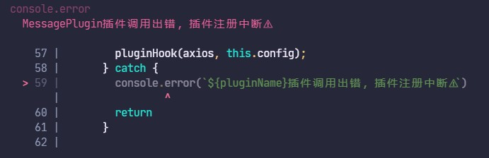

# @axios-plugin

<!--  -->

## 概述

我希望将 `@axios-plugin` 称为一套 axios **请求层拦截器调度解决方案**。

它将项目中自定义封装的请求、响应拦截器进行解构，封装成一个插件，并且通过 `@axios-plugin/core` 将 axios 插件化，
之后就可以在插件化之后的 axios 实例身上挂载各种功能插件。

`@axios-plugin`针对诸如 Token 的添加，接口缓存、错误重试、响应状态码处理、超时处理等常见业务场景，提供了解决方案。另外当这些功能不满足你的需求时，可以通过[自定义插件](https://github.com/mengqiuleo/axios-plugin#%E8%87%AA%E5%AE%9A%E4%B9%89%E6%8F%92%E4%BB%B6)的方式快速封装。


通过插件化的开发，可以实现所有**拦截器职责单一**、方便维护、并**统一维护**和**自动调度**，避免实际业务中对每个项目的重复封装。


## 如何运行的
在 `@axios-plugin/core` 内部，实现了一个 `AxiosPluginify` 类，并且通过向外暴露的 `pluginify` 函数，返回一个 `AxiosPluginify` 类的实例。
在 `AxiosPluginify` 类身上，有 `use` 方法，实现将传入的插件收集到数组中，以便挂载到 `axios` 实例上。
另外，该类还有 `generate` 方法，它会按照传入的插件顺序，依次将这些插件挂载到 传入的 `axios` 实例上，最后返回新的 `axios` 实例。

## 特性
- 按需加载
- 对插件解构，降低代码耦合度
- 提供常见拦截器插件
- 支持自定义插件
- 包装已有类库
- 灵活性高

## 已提供的插件
- [@axios-plugin/retry](/packages/retry/README.md)
- [@axios-plugin/throttle](/packages/throttle/README.md)


## 安装
```bash
npm i @axios-plugin/core
```

## 自定义插件
自定义 Class 实现

插件的 TS 类型定义
```ts
export interface AxiosPlugin {
  pluginName: string;
  beforeCreate?: beforeCreateHook;
  created?: createdHook;
}
```

### PluginClass
```javascript
import axios from 'axios'
import { pluginify } from "@axios-plugin/core"

class Plugin implements AxiosPlugin {
  public pluginName = 'plugin' //必选，插件名，用于记录插件调用出错的情况
  // 可选
  constructor(pluginConfig) {
    this.pluginConfig = pluginConfig;
  }

  // 可选 axios 实例化前创建
  beforeCreate(axiosConfig, axiosStatic) {
    console.log(this.pluginConfig);
    console.log(axiosConfig);
    console.log(axiosStatic);
  }

  // 可选 axios 实例化后创建
  created(axiosInstance, axiosConfig) {
    console.log(axiosInstance);
    console.log(axiosConfig);
  }
}

const axiosInstance = pluginify(axios).use(new Plugin()).generate();

axiosInstance.get('/users');
```

## 包装已有类库

```javascript
import axios from 'axios'
import { pluginify } from "@axios-plugin/core"
import axiosRetry, { IAxiosRetryConfig } from 'axios-retry';

export class RetryPlugin implements AxiosPlugin {
  public pluginName = 'RetryPlugin'
  constructor(public config?: IAxiosRetryConfig) {}

  created(axios: AxiosInstance) {
    axiosRetry(axios, this.config)
  }
}


const axiosInstance = pluginify(axios)
  .use(new RetryPlugin())
  .generate()

axiosInstance.get('/users')
```

## 包装拦截器

```javascript
import axios from 'axios'
import { pluginify } from "@axios-plugin/core"

class RequestWithToken {
  public pluginName = 'RequestWithToken'
  constructor(token) {
    this.token = token
  }
  created(axiosInstance) {
    axiosInstance.interceptors.request.use((config) => {
      config.headers['x-access-token'] = this.token
    });
  }
}

class ExtractResultPlugin {
  public pluginName = 'ExtractResultPlugin'
  created(axiosInstance) {
    axiosInstance.interceptors.response.use((response) => {
      if (response.status === 200) {
        return response.data
      }
    });
  }
}

const axiosInstance = pluginify(axios)
  .use(new RequestWithToken('token'), new ExtractResultPlugin())
  .generate()

axiosInstance.get('/users')
```

## API
### pluginify

```javascript
pluginify(axios)

pluginify(axios, config);
// config 的 TS 类型为 AxiosRequestConfig
```
config 具体内容可参考：https://axios-http.com/zh/docs/req_config

### use

```javascript
const axiosPluginify = pluginify(axios)

axiosPluginify.use(new Plugin(), new Plugin(), new Plugin())

//or

axiosPluginify.use(new Plugin()).use(new Plugin()).use(new Plugin())
```

### demo

```javascript
//1. axiosStatic add config
const config = {
  baseURL: '/users',
  timeout: 5000
}
const axiosInstance1 = pluginify(axios, config).use(new Plugin(), new Plugin()).generate();
const axiosInstance2 = pluginify(axios).use(new Plugin()).use(new Plugin()).generate();

//2. AxiosInstance add config
axiosInstance2.defaults.baseURL = '/users'
axiosInstance2.defaults.timeout = 5000

const res1 = await axiosInstance1.get('/info')
const res2 = await axiosInstance2.get('/info')
```

### generate

创建 `axios` 实例并结合 `use` 方法所给定的插件.

```javascript
const axiosPluginify = pluginify(axios)

const axiosInstance = axiosPluginify.use(new Plugin()).generate()
```

通过向 `generate` 传入 `true` 表示生成 `axiosInstance` 后销毁 `pluginify` 内部保存的引用, 避免内存泄漏.

```javascript
const axiosPluginify = pluginify(axios);

const axiosInstance = axiosPluginify.use(new Plugin()).generate(true)
```

### destroy

用于销毁 `pluginify` 内部保存的引用, 可以通过 `generate(true)` 触发.

### plugin

插件是一个类(也可以是一个构造函数), 可以提供数个生命周期钩子.

```javascript
class Plugin {
  public pluginName = 'Plugin' //required
  
  // optional
  constructor() {}

  // optional
  beforeCreate(axiosRequestConfig, axiosStatic) {}

  // optional
  created(axiosInstance, axiosRequestConfig) {}
}
```
这里的 axiosInstance 代表 创建出的 axios 实例，axiosStatic 代表 axios 本身

## FAQ


### 插件的执行顺序是怎样的

`@axios-plugin` 会按照 `use` 方法的执行顺序来处理它们的挂载。

但在 axios 内部，对于请求拦截器，是先挂载的后执行；对于响应拦截器，是先挂载的先执行。


### 遇到不正确的插件

这里对自定义插件的要求很低，只要编写的插件中含有 beforeCreate 或者 created 函数就OK，至于在函数内部做的事情都不做要求，最后在统一调用时，依次取出所有的插件函数执行。

目前对插件调用出错的情况，向外抛错，插件调用流程终止。
<!--  -->